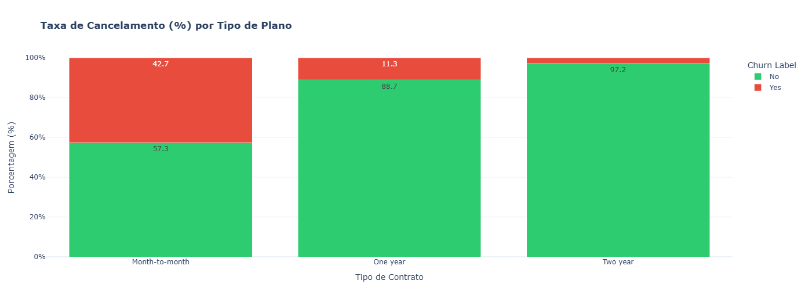
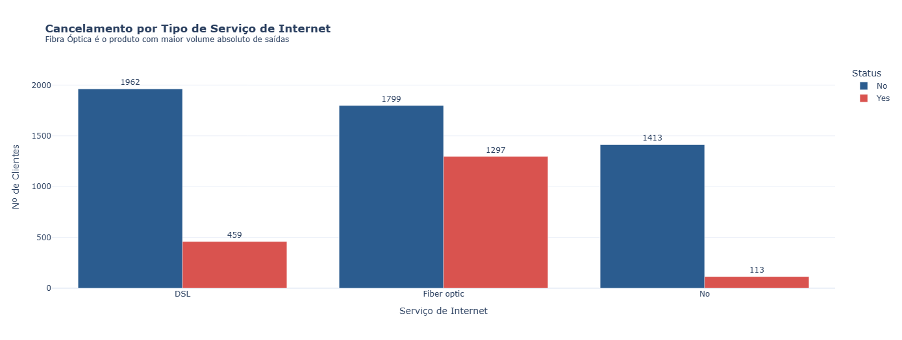
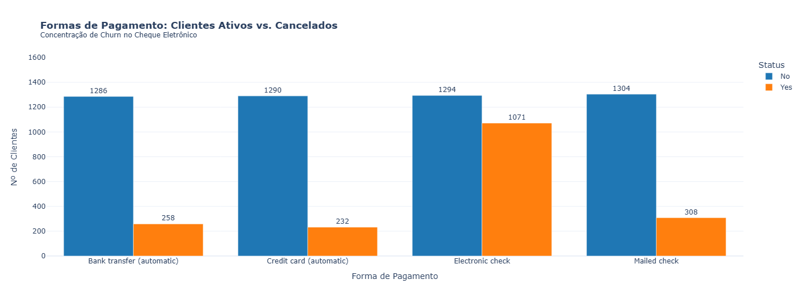
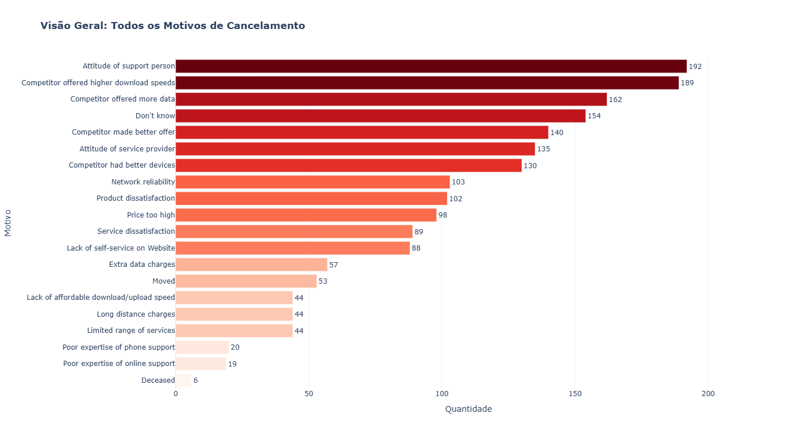

# analise-cancelamento-telecom
 Visão Geral do Problema
   
O objetivo desta análise é responder a uma das maiores dores de empresas de telecomunicações: por que os clientes estão cancelando seus serviços e como reter a receita da base?

 A base analisada possui 7.043 clientes e apresenta uma taxa global de cancelamento de 26,5%.

 Principais Descobertas (Data Insights)
 A. Impacto do Modelo Contratual e Previsibilidade de Caixa
Achado: Clientes no plano mensal (Month-to-month) possuem uma taxa de cancelamento de 42,7%, enquanto contratos anuais e bienais apresentam apenas 11,3% e 2,8% de churn, respectivamente.

Impacto no Negócio: O modelo mensal gera alta volatilidade na receita e eleva o custo de substituição de clientes (CAC). A transição para modelos plurianuais garante maior previsibilidade de caixa e estabilização do faturamento.

 B. Fibra Óptica, Percepção de Valor e Fuga de Clientes High-LTV
Achado: O serviço de Fibra Óptica concentra a maior taxa absoluta e relativa de cancelamento (41,9% contra 19,0% da tecnologia DSL).

Impacto Financeiro (Revenue Churn): Clientes de Fibra Óptica possuem o ticket médio mais alto (~US$ 115/mês). O cliente nº 1 em faturamento histórico de toda a empresa (US$ 8.684,80 acumulados em 6 anos) cancelou o serviço devido a problemas de velocidade frente à concorrência, evidenciando uma sangria desproporcional nos clientes de maior valor acumulado (Lifetime Value).

C. Fricção no Pagamento: Cheque Eletrônico vs. Cobrança Automática
Achado: 57,3% de todo o churn da empresa ocorre entre clientes que pagam via Cheque Eletrônico (Electronic Check), com uma taxa de cancelamento de 45,3% nesta modalidade.

Impacto no Comportamento: Pagamentos manuais exigem uma decisão ativa a cada ciclo de faturamento, criando uma janela mensal de reflexão em que o cliente reavalia a continuidade do serviço. Em contrapartida, clientes com débito ou cartão automático apresentam churn de apenas ~15%.

 D. Diagnóstico do Atendimento: Suporte Técnico vs. Concorrência
Achado: Ao analisar os motivos individuais de cancelamento, a atitude da equipe de Suporte Técnico (Attitude of Support Person) é o motivo isolado nº 1 (192 cancelamentos), seguido de perto por ofertas da concorrência com maior velocidade ou franquia de dados.

Especificidade: O gargalo no atendimento não está concentrado no SAC comercial, mas sim na experiência de suporte de engenharia/resolução de falhas técnicas, gerando frustração no momento de instabilidade do serviço.

Plano de Ação Estratégico Integrado
Em vez de ações isoladas, a recomendação executiva propõe uma "Super Oferta Combinada" para atacar as três principais causas de cancelamento em uma única campanha de conversão:

A Oferta Combinada (Aquisição e Retenção)
Condicionar o plano de Fibra Óptica ao Contrato Anual com pagamento via Cartão de Crédito ou Débito Automático. Em troca, o cliente recebe:

15% de desconto nas 3 primeiras mensalidades.

Inclusão gratuita de Serviços de Valor Agregado (SVAs): Tech Support e Online Security nativos na fatura (serviços que comprovadamente reduzem o churn para ~15%).

Ações Operacionais e Governança de Suporte
Reciclagem do Suporte Técnico: Capacitação contínua focada em resolutividade no primeiro contato (First Call Resolution), reduzindo o atrito em chamados de manutenção.

Célula de Retenção para Clientes VIP (High-LTV): Fila de atendimento prioritária para clientes de alta receita (mensalidade > US$ 100) com problemas técnicos reincidentes, bloqueando a migração preventiva para concorrentes.

Tecnologias Utilizadas
Linguagem: Python 3.x

Manipulação de Dados: Pandas

Visualização Interativa: Plotly Express / Plotly Graph Objects

Ambiente de Desenvolcimento: Google Colab
